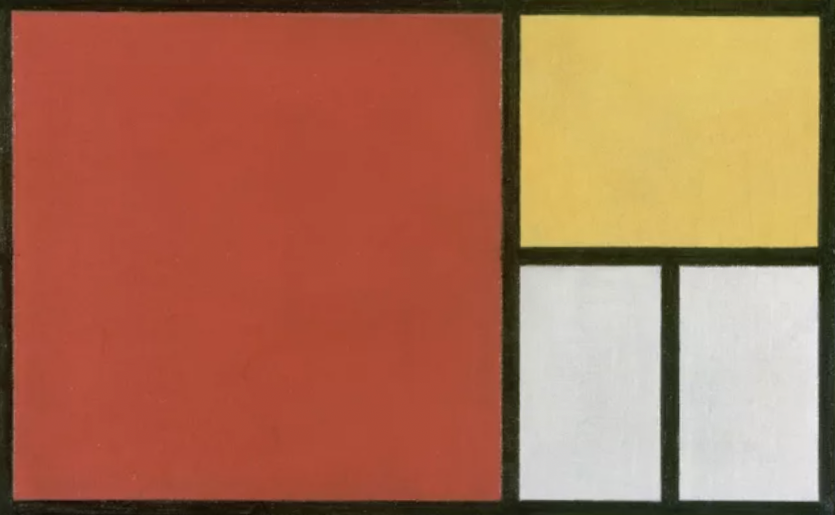
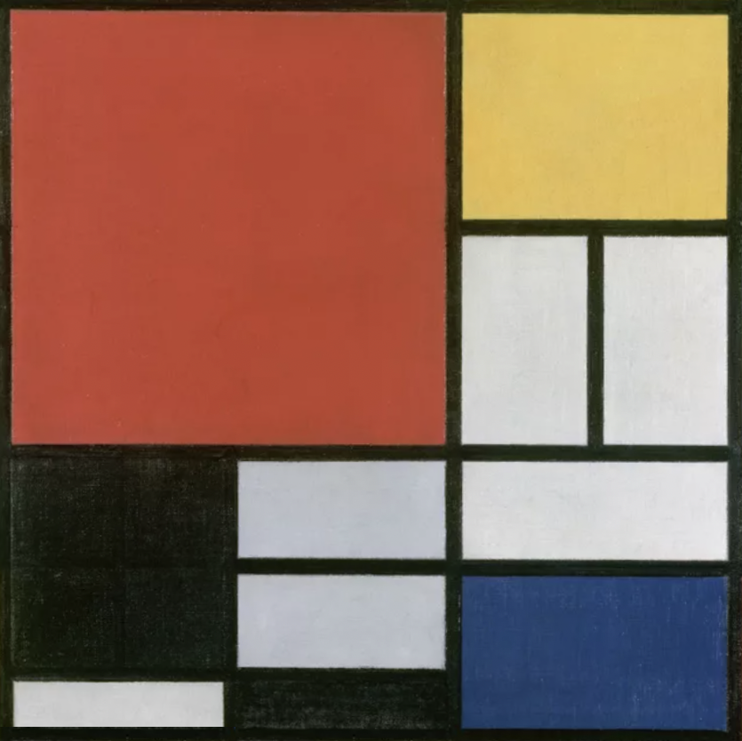

# HTML & CSS Afternoon Activities

Across the HTML and CSS days, we're going to cover many topics. It hence makes sense for us to provide a few different afternoon activities which aim to cover many of these topics. This does also mean, however, that many of the exercises are pretty open-ended. Explore each exercise a little but don't feel like you need to sink a lot of time into each. As long as you are happy with what has been introduced during these days—and you can later build on it—then we're golden.

When you have started making progress on any of these exercises below, please do push your code up to a new GitHub repo.

## Further Reading

### Required Reading

As mentioned within the HTML & CSS chapters, there is an **Accessibility Primer** document which has been provided to you which you are expected to go through in your own time. You are simply expected to read through the document, making any notes as you see fit, as the idea is to simply expose you to the topic of Web Accesibility at this time.

There is also a set of notes on **CSS Selectors** which we ask you to cover.

### Optional Reading

There are a few, small, additional pieces of written content which you are free to explore in your own time within the textbook. These topcis are:

- CSS Flexbox
- CSS Grid
- CSS Animations (Explicit animations and the CSS `transition` property)
- Media Queries
- Utility Classes & CSS Custom Properties (CSS variables)

## Decomposition & Wireframing

Time to get hands-on! Frontend web development contains more nuance than is maybe apparent when you first begin putting together a website. HTML and CSS are incredibly powerful tools and a lot of functionality is provided out-of-the-box, so for these afternoon tasks, we are asking you to focus on these two. You'll have plenty time with JavaScript in the following chapters, don't worry.

The task we're setting is similar to that you worked on during the assessment days: Build a website to get familiar with HTML and CSS.

This time, we're not providing a brief, we're leaving both the topic and the design entirely up to you. We would, however, recommend that you try recreate an already existing website, ideally one with multiple distinctly organised regions. Start with either a mobile or desktop site alone for now. The task is broken into two parts:

### Decomposition

First step is to take an existing webpage and break it down. Take a look at the page using the Dev Tools (`right click` + *`"inspect"`* or `f12`) and try not get too intimidated. A lot of modern webpages have many moving parts, some of which are not visually represented such as tracking scripts, so don't worry if you're not able to follow the entire DOM structure in front of you. At the top left of the Dev Tools is generally a square with an arrow in it. This is the **Inspect Tool** which allows you to click on an element on a webpage to move to it in the DOM. You may find this incredibly handy for this task.

- Find a website that you like the look of that has interesting design elements
- Explore the website with Dev Tools open, inspecting how the page is built
- Create a high-level wireframe design showing the regions of the page
- Take a more complicated region and begin breaking it down further, outlining how the elements are nested within each other

For wireframing, you could use Miro, Figma or simply draw it out using pen and paper.

### Wireframe Implementation

Now that you have a wireframe outlining the structure of your chosen webpage, attempt to build it back up. Can you envision different ways of building up each region? Can you think of why a chosen implementation was chosen?

There are going to be many CSS properties which you haven't encountered previously which will could be being used on your chosen webpage. The Inspect Tool is handy for viewing what properties are being applied where, but please take the time to read over the MDN documentation whenever you encounter something new as a better understanding of many properties will prepare you for success in the future.

## Flexbox & Media Queries

Flexbox can be a tricky thing to wrap your head around. To practice what you have learned here today, it is best to give it a go yourself. Below are a couple exercises which explore CSS flexbox and media queries—the beginnings of responsive design.

### Flexbox Froggy 

If you fancy testing your knowledge but don't fancy building a webpage then Flexbox Froggy is a great online resource which we can recommend for testing your knowledge:

[FlexBox Froggy - https://flexboxfroggy.com/](https://flexboxfroggy.com/)

*Image taken from the Flexbox Froggy site.*

### Implicit Responsive Design

This exercise builds off of the *"Decomposition & Wireframing"* exercises above. With your webpage from the previous example, repeat the same steps regarding decomposition and wireframing but for the desktop or mobile design—whichever you didn't build previously. Think about how you can arrange different parts of the page using `display: flex` and its adjoining properties.

Flexbox is as the name suggests: flexible. This flexibility is what you should introduce to your site initially when approaching responsive design. Because of the variation in screen widths, it's important that you avoid pinning down your site as much as possible, as this would create avenues towards structural failure. Flexibility is key!

[MDN Docs - Flexbox](https://developer.mozilla.org/en-US/docs/Learn/CSS/CSS_layout/Flexbox)

[CSS Tricks - A Complete Guide to Flexbox](https://css-tricks.com/snippets/css/a-guide-to-flexbox/)

### Explicit Responsive Design

Sometimes, however, it isn't possible to do everything with flexbox. Hiding content, placing it behind togglable menus, or other large-scale organisational differences tied to screen size are best implemented with media-queries. Play about with this feature to introduce the final bits to your responsive web page.

Dev Tools provides a means to visualise your page at the aspect ratios and apparent resolutions of different mobile devices. Simply click the little mobile phone icon at the top bar on either Chrome or Firefox.

Dev Tools can be opened in a separate window for if you want to use it while also viewing your page fullscreen.

[MDN Docs - Media Queries](https://developer.mozilla.org/en-US/docs/Web/CSS/Media_Queries/Using_media_queries)

## CSS Grid

As with everything, new topics make more sense once we get hands-on and start practising. There are a couple tasks we are recommending you spend some time with to practice using CSS Grid. 

[MDN Docs - Grid](https://developer.mozilla.org/en-US/docs/Web/CSS/grid)

### CSS Garden

The first is the CSS Grid compliment to Flexbox Froggy, CSS Grid Garden, where the aim is to water your crops and poison weeds by specifying the CSS Grid properties and values needed. 

[CSS Grid Garden game](https://cssgridgarden.com/)

### Mondrian Example

The second task provides a bit more hands-on experience. In this task, we are asking you to construct a portion of a Piet Mondrian painting using only HTML and CSS. You can use either local files or a site such as [CodePen](https://codepen.io/) for this exercise. If you feel like you want a higher degree of accuracy than eye-balling the image allows, then within the Firebox Developer Tools, you can toggle the *"Measure a portion of the page"* option for access to an on-screen ruler. You may find opening the image in a new tab also helps.

Start with the above example with only four blocks and then attempt the second image for further practice if you would like.

*(Thank you to Jen Kramer for the inspiration of this practice exercise)*

